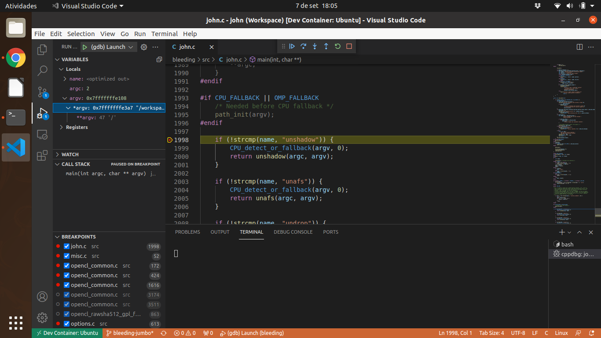

# IDE Integration

Visual Studio Code provides facilities for software development, including a debugger. I use it as a [sandbox build environment](https://code.visualstudio.com/docs/remote/containers).

Visual Studio Code Remote Development allows you to use a container as a full-featured development environment. My reasoning about using it is: it keeps the "host" machine clean. Another advantage is the possibility to choose the develpment environment according to the need, I can use Ubuntu LTS or the latest version, or Fedora, or Debian, ...

In here you can find the project files (the workspace). Basically, you should use it this way:

```
project
│   john.code-workspace
│   .devcontainer
│
└───john main folder
│   └───doc
│   └───run
│   └───src
│   │   .vscode
│   │   [...]
```

## Debugging JtR Using Visual Studio Code

- Debugging in action:
  - watch the breakpoint, inspection of variable contents, "step in", "step into", "step out". Stop using `printf()` while experimenting with John the Ripper.

